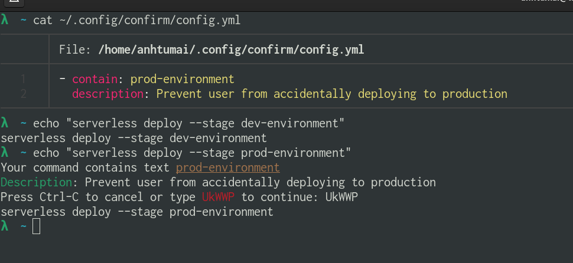
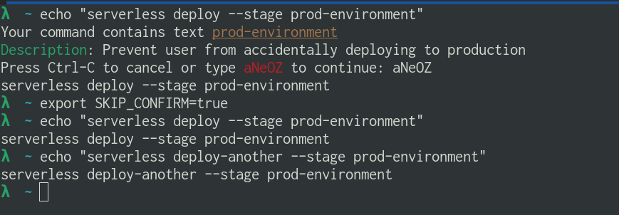

# Confirm

```
A zsh `middleware` forcing user to confirm before executing commands
with selected keywords.
```

## Demo

Users can define a YAML config file, specifying keywords of dangerous commands
that they don't want to execute by accident.
For example, `serverless deploy --stage prod-environment`

When the middleware detects a dangerous command,
it will force the user to confirm by re-typing a random string, to avoid muscle memory.



Export env var `SKIP_CONFIRM=true` if you want to temporarily ignore the middleware.



## Installation and Usage

**Requirements**:

- This project is only applied for Zsh.
- [Cargo](https://doc.rust-lang.org/cargo/getting-started/installation.html) is needed

### 1. Build from source

```bash
git clone git@github.com:anhtumai/confirm.git
cargo build --release
cp target/release/confirm /usr/local/bin

## Ensure system can recognise confirm binary
which confirm
## /usr/local/bin/confirm
```

### 2. Create a YAML config file with the following format

```YAML
- contain: string
  description (optional): string
  regex (optional): bool
```

- contain: text/regex pattern to search in the command, depending on `regex` option
- description: explains why the rule is needed
- regex: if set to `true`, `contain` will be treated as a regex pattern

### 3. Ensure these lines exist in your `.zshrc` with correct order

```zshrc
function preexec_confirm() {
    CONFIG_PATH="/home/anhtumai/.config/confirm/config.yml" //change this
    confirm $CONFIG_PATH $1
}

autoload -Uz add-zsh-hook

add-zsh-hook preexec preexec_confirm
```

## Uninstallation

Remove the above lines in `.zshrc` and run `rm /usr/local/bin/confirm`
